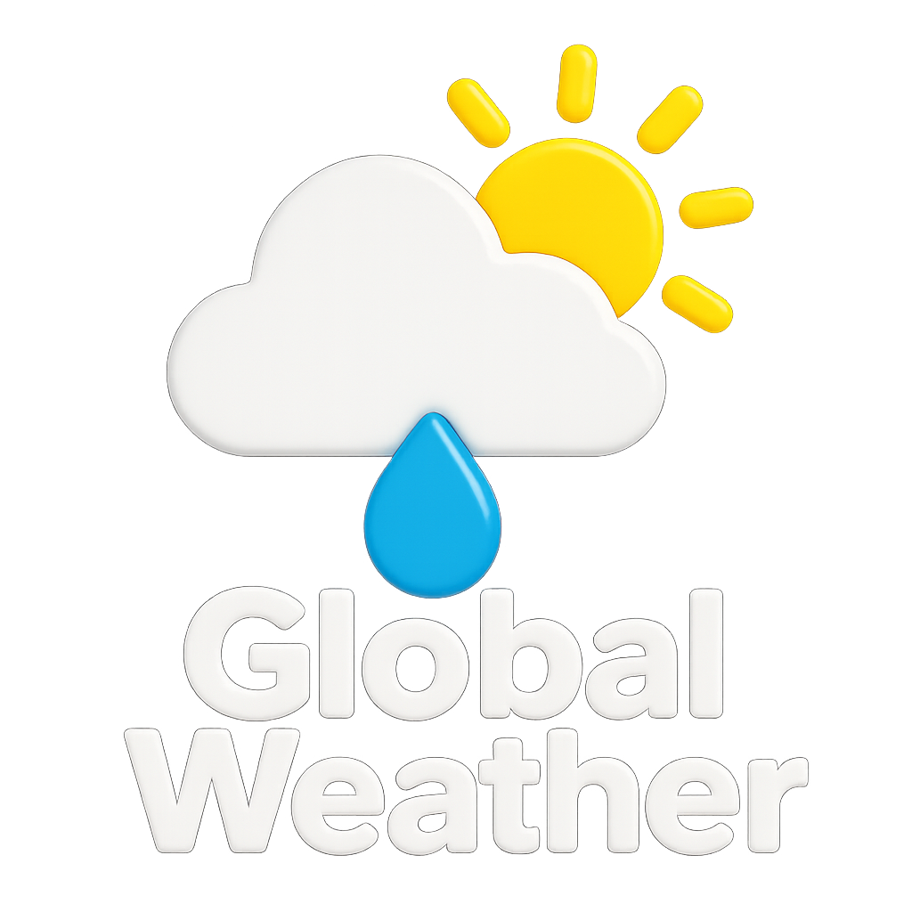

# 🌤️ Global Weather App

A modern, responsive weather application built with React, TypeScript, and Tailwind CSS. Get real-time weather information for any location worldwide with an intuitive and beautiful interface.



## ✨ Features

### 🏠 **Dashboard**
- **Current Location Weather**: Automatic geolocation-based weather display
- **Detailed Weather Information**: Temperature, humidity, wind speed, pressure, and more
- **Hourly Temperature Chart**: Interactive temperature trends for the next 24 hours
- **5-Day Forecast**: Extended weather outlook with daily highs/lows

### 🔍 **Smart City Search**
- **Real-time Search**: Search for cities worldwide with auto-suggestions
- **Search History**: Keep track of recently searched locations
- **Favorites System**: Save and quickly access your favorite cities
- **Advanced Command Dialog**: Intuitive search interface with keyboard navigation

### 🌙 **User Experience**
- **Dark/Light Theme**: Seamless theme switching with system preference detection
- **Responsive Design**: Optimized for desktop, tablet, and mobile devices
- **Loading States**: Smooth loading animations and skeleton screens
- **Error Handling**: Graceful error handling with user-friendly messages

### 📊 **Data Visualization**
- **Interactive Charts**: Temperature trends using Recharts
- **Weather Icons**: Dynamic weather condition icons from OpenWeatherMap
- **Gradient Backgrounds**: Beautiful weather-themed gradients

## 🛠️ Tech Stack

### **Frontend**
- **React 19** - Modern React with latest features
- **TypeScript** - Type-safe development
- **Vite** - Lightning-fast build tool
- **React Router** - Client-side routing

### **Styling & UI**
- **Tailwind CSS 4** - Utility-first CSS framework
- **Radix UI** - Headless UI components
- **Lucide React** - Beautiful SVG icons
- **shadcn/ui** - Component library built on Radix UI

### **State Management & Data Fetching**
- **TanStack Query (React Query)** - Powerful data synchronization
- **Local Storage** - Persistent favorites and search history

### **Charts & Visualization**
- **Recharts** - Composable charting library
- **date-fns** - Date utility library

### **Developer Experience**
- **ESLint** - Code linting
- **TypeScript** - Static type checking
- **Prettier** - Code formatting

## 🚀 Getting Started


### Installation

1. **Clone the repository**
   ```bash
   git clone https://github.com/Yukikaze-coder/Global-Weather.git
   cd Global-Weather
   ```

2. **Install dependencies**
   ```bash
   npm install
   ```

3. **Set up environment variables**
   ```bash
   cp .env.example .env
   ```
   Add your OpenWeatherMap API key to `.env`:
   ```env
   VITE_OPENWEATHER_API_KEY=your_api_key_here
   ```

4. **Start the development server**
   ```bash
   npm run dev
   ```

5. **Open your browser**
   Navigate to `http://localhost:5173`

### Get Your API Key
1. Visit [OpenWeatherMap](https://openweathermap.org/api)
2. Sign up for a free account
3. Navigate to API keys section
4. Copy your API key to the `.env` file

## 📝 Available Scripts

```bash
# Development
npm run dev          # Start development server

# Production
npm run build        # Build for production
npm run preview      # Preview production build

# Code Quality
npm run lint         # Run ESLint
```

## 🏗️ Project Structure

```
src/
├── api/              # API configuration and services
│   ├── config.ts     # API endpoints and configuration
│   ├── types.ts      # TypeScript type definitions
│   └── weather.ts    # Weather API service
├── components/       # Reusable UI components
│   └── ui/           # UI component library
├── context/          # React context providers
├── hooks/            # Custom React hooks
├── lib/              # Utility functions
└── pages/            # Page components
```

## 🎯 Key Features Explained

### **Geolocation Integration**
- Automatic location detection using browser's geolocation API
- Fallback options for users who deny location access
- Reverse geocoding to display location names

### **Favorites System**
- Add/remove cities to favorites
- Persistent storage using localStorage
- Quick access from search dialog
- Real-time weather data for favorite cities

### **Search History**
- Tracks recently searched locations
- Persistent across browser sessions
- Easy clearing of search history
- Timestamps for search entries

### **Weather Data**
- Current weather conditions
- 5-day forecast
- Hourly temperature trends
- Detailed metrics (humidity, pressure, wind, etc.)
- Sunrise/sunset times

## 🎨 Design System

### **Colors**
- Support for light and dark themes
- Consistent color palette
- Weather condition-specific colors

### **Typography**
- Clean, readable fonts
- Consistent sizing scale
- Proper contrast ratios

### **Components**
- Modular, reusable components
- Consistent styling with Tailwind CSS
- Responsive design patterns

## 🌐 API Integration

### **OpenWeatherMap API**
- Current weather data
- 5-day weather forecast
- Geocoding for city search
- Reverse geocoding for coordinates

### **Endpoints Used**
- `/weather` - Current weather
- `/forecast` - 5-day forecast
- `/geo/direct` - Forward geocoding
- `/geo/reverse` - Reverse geocoding

## 📱 Responsive Design

- **Mobile First**: Optimized for mobile devices
- **Tablet Support**: Adapted layouts for tablets
- **Desktop**: Full-featured desktop experience
- **Touch Friendly**: Large touch targets for mobile

## 🔧 Configuration

### **Environment Variables**
```env
VITE_OPENWEATHER_API_KEY=your_api_key_here
```

### **Tailwind CSS**
Custom configuration for:
- Color scheme
- Spacing system
- Component variants
- Dark mode support


## 📄 License

This project is licensed under the MIT License - see the [LICENSE](LICENSE) file for details.

## 👨‍💻 Author

**Morandini Luigi**
- GitHub: [@Yukikaze-coder](https://github.com/Yukikaze-coder)

## 🙏 Acknowledgments

- [OpenWeatherMap](https://openweathermap.org) for weather data
- [Tailwind CSS](https://tailwindcss.com) for styling
- [Radix UI](https://radix-ui.com) for accessible components
- [Lucide](https://lucide.dev) for beautiful icons
- [Recharts](https://recharts.org) for data visualization

---

Made with ❤️ by Morandini Luigi © 2025